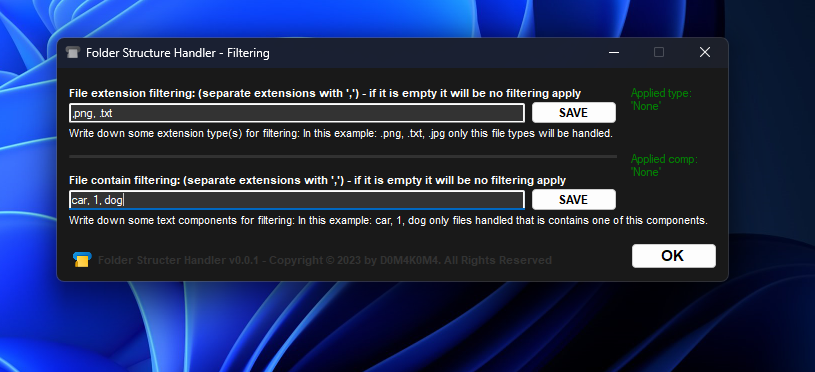

# Folder-Structer-Handler-FSH

 

# About: 

That small tool helps people to destructure a folder even large complex one, and than you have like a folder_name_(Destructed) folder and that folder includes all the contains of the subfolders basically all the file is dumped to one folder,and in this one folder you can easly able to batch work on some file and you be able to manage files after than, you can restruct folder with 'resigner.restruct' and you get back your original folder with the files restructured to subfolders.

# Features:

The app have a folder destructure and restructure features (also the program rename the same name files when destruct, than when restruct the program reuse the original file name), and in addition the program able filter files by extension and file name contents too.

The app generated '(Destructure)' folders moveable so if you want, you can able to restruct the folder in a different computer included with installed Folder Structer Handler.

# Informations

The app is installable where the user want, the basic structure of the program is this:

 

also after the setup installation, we got a shortcut on desktop for filter settings:

 

# Usage:

After the setup intallation we got a shortcut, but we firstly intrested about the the destruct, restruction.
So we want to destruct a folder, so in order to know how to do this just click on a folder that you want to destruct, and you'll see the context menu right here:

 

You can choose the destruct than you'll see this...

 

Than you destruct your targeted folder you have in that case a Test_folder_(Destructured) folder that is holds all the file in the same folder like this:

 

Than you able to restruct your files to the original structured folder:

 

-----------------------------------------------------------------------

# Filtering:

You can filter files by name and extension, and with that you have an option to choose what you want to see in your destructed folder as well:

To set a new filter, click just to the 'Folder Structer Handler - Filtering' shortcut than you'll see this:

 

Actually i fill it already...

And you can set this filters by click to 'SAVE' button each of this, than if you click the 'SAVE' button again you'll will set the filteration to 'none'. So that how you can set some filtering to files.
